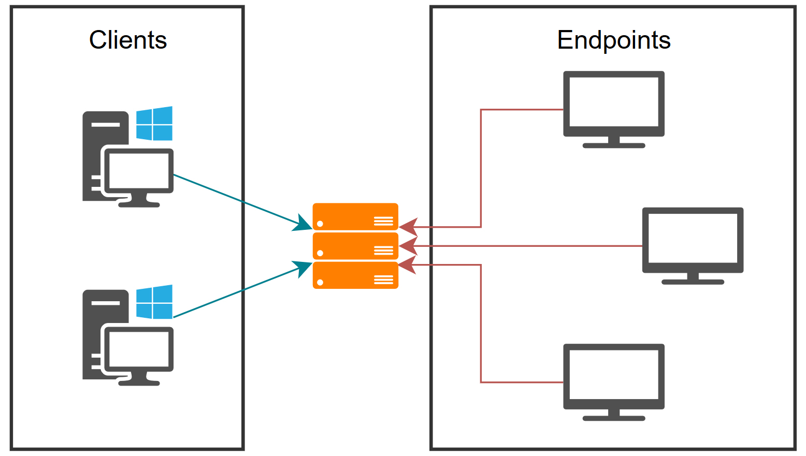

# tv-managing-system
System designated to implement in company easy TV display system.
It allows deploy TVs (endpoints) based on linux (e.g. Raspberry Pi) and manage all of them using single pc.

>
> \[!NOTE]
>
> Project created for [100commitow](https://100commitow.pl/) challange.

## Overview

System consists of 3 main parts:
- **Server** - that manages whole system
- **Endpoint** - any display connected to PC
- **Client** - that allows to manage system (change settings etc.)

Main purpose of this system is to allow you to easily setup display system (e.g. in company) and give you user-friendly access to manage it.

Very important is that, this system is opensource, so you can customize it how you want and adapt to your needs.

## Usage
TODO

## Installation
TODO

## Description
### Server
*Linux*

Server is responsible for managing whole system. It communicates with endpoint to distribute configuration. 

TODO

### Client
*Windows*

Client application gives end-user ability to easily manage the system. It provides GUI based communication with server, so it is user-friendly. You can check actual status of endpoints, manage global / per endpoint configuration and reload endpoints settings.

### Endpoint
*Linux*

Endpoint allows to display images on TV (any display connected to machine), using X11 library. Its main advantage is that is written in C++, so it allows to obtain low system requirements. That allows you to make low cost and practical display system (e.g. TV connected to Raspberry Pi). Endpoint program gets settings from server. Files to be displayed are obtained from path. To make fully centrally managed system (meaning easy access to files on endpoint) you can setup SMB server, mount it on every endpoint and configure path on tv-managing-system server to this mountpoint.

## Configuration
TODO

## Security
TODO about authentication and secure connection

## ToDo
- [ ] Description (Readme)
- [ ] Documentation
- [ ] Server
  - [x] Configuration
    - [x] Loading configuration
    - [x] Storing configuration
  - [ ] Socket
    - [x] Creating socket
    - [x] Making connection
    - [x] Multiple connections
    - [ ] Cleanup code
    - [x] Callback function for every read
  - [ ] Command handling
    - [x] System for handling
    - [ ] Real functions to use
    - [ ] Cleanup and testing
  - [ ] Endpoint settings
    - [x] Struct
    - [x] Loading from file
    - [ ] Creating default file
    - [x] Sending through socket
    - [x] Saving settings into file
  - [ ] Endpoint manager
  - [ ] Requests handling
- [ ] Client
  - [ ] **Rewrite to Qt**
  - [ ] Socket
    - [x] Creating socket
    - [x] Connecting
    - [x] Send and Receive
    - [ ] Cleanup, improvements and testing
  - [ ] Getting data
    - [x] List of endpoints
    - [x] Endpoint settings
    - [ ] Is endpoint connected
    - [ ] Auto load endpoints list after connection
  - [ ] GUI
    - [x] Connection window
    - [x] Showing list of endpoints
    - [ ] Showing endpoint settings
  - [ ] Sending data
- [ ] Endpoint
- [ ] Automatic sync

## Bug list
- Server
  - [x] *#1 CommandHandler: if command not found (now it executes everytime) executes probably last added command (REV in this example)*
    *It was probably not compiled and installed latest version when testing*
  - [ ] #2 ServerSocket?: if client terminate connection server can occur exception on basic_string.tcc:225
  - [ ] #3 ConfigLoader: removes all spaces in string (including in value) *(maybe i make it as feature - you need to set values without spaces)*
  - [ ] #6 CommandHandler: cannot handle command if argument has spaces
- Client
  - [x] #4 MainWindow: after disconnecting throws error
  - [x] #5 EndpointManager: Saving directory fails *(ex. "\004")*

> **SEGFAULT COUNTER**: 5
